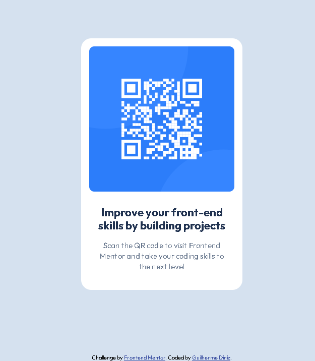

# Frontend Mentor - Solução para o Componente de QR Code

Esta é a minha solução para o desafio [QR code component challenge](https://www.frontendmentor.io/challenges/qr-code-component-iux_sIO_H) do Frontend Mentor.  
Os desafios do Frontend Mentor ajudam a aprimorar habilidades de codificação através da criação de projetos realistas e focados em boas práticas de desenvolvimento.

## 🗂️ Índice

- [Visão Geral](#visão-geral)
  - [Captura de Tela](#captura-de-tela)
  - [Links](#links)
- [Meu Processo](#meu-processo)
  - [Construído com](#construído-com)
  - [O que Aprendi](#o-que-aprendi)
  - [Desenvolvimento Contínuo](#desenvolvimento-contínuo)
- [Autor](#autor)
- [Contato](#contato)

---

## 📋 Visão Geral

### Captura de Tela

### Links

- URL do site publicado: [Clique aqui]([https://your-live-site-url.com](https://guilherme-ddiniz.github.io/qr-code-main/))

---

## 🚀 Meu Processo

### Construído com

- HTML5 semântico
- CSS3 com propriedades personalizadas (CSS Variables)
- Flexbox para layout responsivo
- Fluxo de trabalho Desktop-first
- Controle de versão com Git

### O que Aprendi

Este projeto foi uma excelente oportunidade para consolidar meus conhecimentos de HTML e CSS3.  
Além disso, pratiquei o uso do Git para controle de versões, o que me permitiu adotar um fluxo de trabalho mais organizado e eficiente.

### Desenvolvimento Contínuo

- Pretendo continuar evoluindo na utilização do Git e GitHub, tornando o processo de versionamento mais natural e automatizado.
- Apesar de não ter utilizado neste projeto quero aprofundar meus conhecimentos em **CSS Grid** para aplicar em projetos futuros com estruturas de layout mais complexas.

---

## 👨‍💻 Autor

- GitHub - [Guilherme-dDiniz](https://github.com/Guilherme-dDiniz)
- Frontend Mentor - [@Guilherme-dDiniz](https://www.frontendmentor.io/profile/Guilherme-dDiniz)

